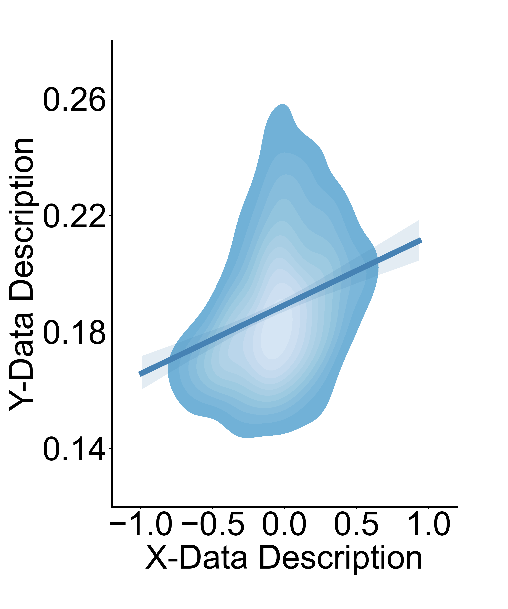
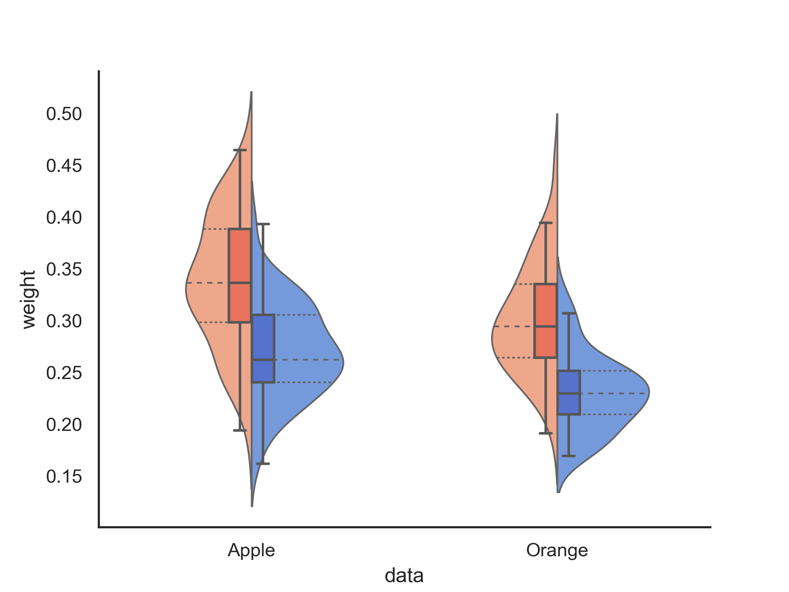
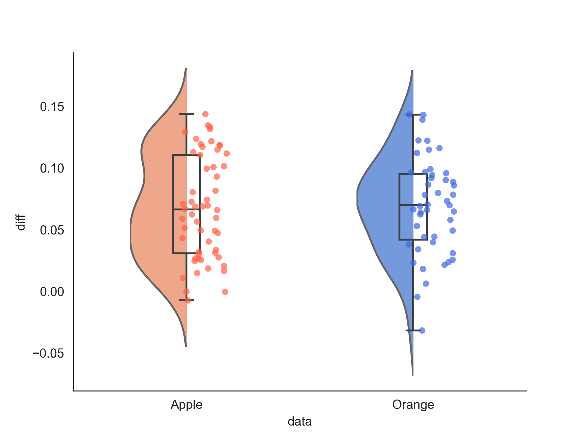

# density_box_violin_plot
Commonly used python-based visualization codes in statistics, including density plot, violin_scatter_box plot and others.

   

***From left to right: Density plot, Violin_Box plot, Violin_Scatter_Box plot*** 

----------------

## Example data

### Density

Suppose you have two data `x` and `y`, **density plot** helps you plot the relationship between x and y. 

### Violin_Box

Suppose you have two kinds of fruits (`data`) `Apple` and `Orange`, the weights of each fruit on different scales (`type`) are different, namely `normal` and `special`.

**Violin_Box plot** helps you visualize the *difference within groups*. For example, you can see the difference in weight between `normal` `apple` and `special` `apple`.

### Violin_Scatter_Box

Suppose you want to further make the difference between `normal` and `special`, you can use **Violin_Scatter_Box** to plot your result. It can helps you visualize the *difference between groups*.
